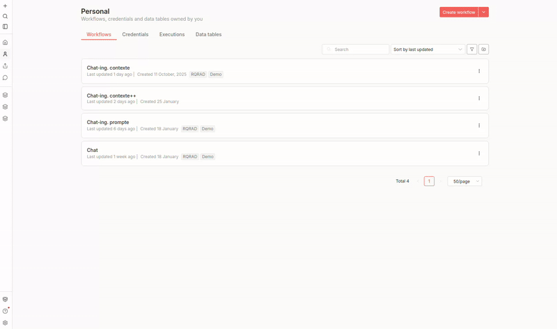
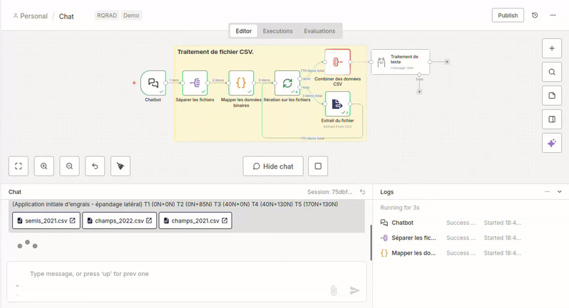

# RQRAD 2026 - n8n Demo
RQRAD LLM demo for the 2026 anual conference

This demo is to demonstrate how to use open-source models (Ollama) and automation flow pipeline (n8n) while presenting the difference among standard, prompt engineering and context engineering in the context of agriculture.

# Quickstart
- Create an account at n8n (https://n8n.io/)
- Create a workflow
- Create credentials

# Standard

# Prompt Engineering

# Context Engineering

# Author
Haechan Mark Bong (https://www.linkedin.com/in/haechan-mark-bong/)
